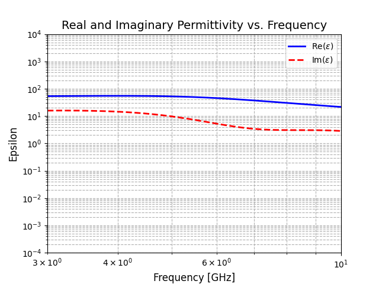
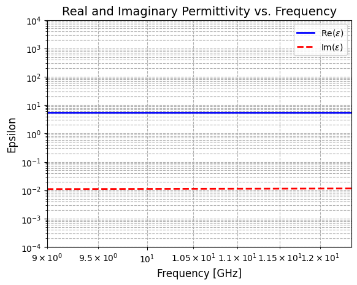

# Supported Materials

31 Materials, with more to come

- 3D Quartz–alumina silica nitride

- Alumina 96–97% dense

- Alumina 99.5% dense

- Alumina 99.9% dense

- Barium titanate

- Beryllium oxide

- Boron nitride

- Cordierite

- Corning 7940 fused silica

- Corning 7957

- Fused silica glass Dynasil 4000

- Fused silica-glass

- Gallium arsenide

- Germanium

- Magnesium aluminum titanate

- Magnesium calcium titanate

- Magnesium oxide

- Magnesium titanate

- Mullite 97% dense

- Sapphire wafer

- Shuttle tile FRIC12

- Shuttle tile LI2200

- Silicon nitride

- Silicon

- Slip-cast silica

- Spinel magnesium aluminum oxide

- SRM 709 Lead-oxide glass

- SRM 710a Sodalime glass

- Zinc selenide

- Zinc sulfide

